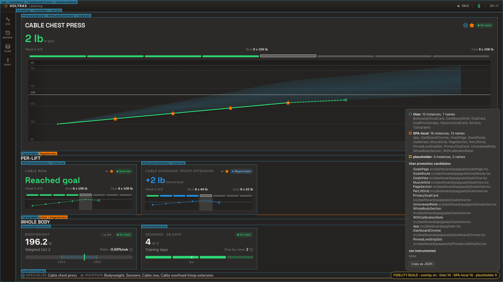

# Dashboard fidelity overlay (VW-431)

The fidelity overlay is a dev-only layer for the dashboard SPA. It shows which parts of a
page come from `@titan-design/react-ui`, which are SPA-local components (the titan
promotion candidates), and which are declared placeholders. This page documents the mount
registry, the provenance wrapper and the overlay that reads them.

All of it lives in `src/dashboard/spa/dev/fidelity/`. Production source never imports that
folder. `src/dashboard/__tests__/spa-fidelity-registry.test.ts` fails if any file under
`src/` outside the folder and its own tests mentions `dev/fidelity`.

## The registry

`dev/fidelity/registry.ts` is a plain module store with no React context. It exports three
functions:

| Function              | Returns                                                                  |
| --------------------- | ------------------------------------------------------------------------ |
| `register(entry)`     | A function that removes exactly that entry. Call it on unmount.          |
| `subscribe(listener)` | A function that removes the listener. The listener runs on every change. |
| `snapshot()`          | The current snapshot, the same object until the registry next changes.   |
| `uninstrumented()`    | Components the build saw but could not wrap, as `{ name, source }`.      |

`snapshot()` is stable between changes, so `useSyncExternalStore(subscribe, snapshot)`
works directly. Listeners still run on every change, but the snapshot itself is rebuilt
lazily on the next read, so a page mounting n components costs O(n) rather than O(n²). A
listener that re-renders should coalesce, as the overlay does (one microtask per burst).

### Entry shape

```ts
interface FidelityEntry {
  id: string; // one mounted instance; matches its marker spans
  kind: 'titan' | 'spa' | 'placeholder';
  name: string; // component name, for example 'Surface' or 'PanelCard'
  source: string; // import specifier for titan, SPA file path otherwise
  testID?: string; // the instance's testID prop, when it has a string one
}
```

### Snapshot shape

```ts
interface FidelitySnapshot {
  entries: FidelityEntry[]; // every mounted instance
  kinds: Record<'titan' | 'spa' | 'placeholder', { instances: number; names: string[] }>;
}
```

`instances` counts mounted entries of that kind. `names` lists each distinct name once,
sorted.

## The window handle

Importing the registry sets `window.__vmcpFidelity` to
`{ register, subscribe, snapshot, uninstrumented }`.
Playwright and other dev tools read it from the page, for example:

```ts
const counts = await page.evaluate(() => window.__vmcpFidelity?.snapshot().kinds);
```

The handle exists only in a bundle that imports the registry, which a production build
never does.

## The provenance wrapper

`withProvenance(Component, { kind, name, source })` in `dev/fidelity/with-provenance.tsx`
returns a `forwardRef` component. It:

- forwards every prop and the ref to `Component`, so a titan parent that clones its
  children with injected props and refs still reaches the real component;
- renders `Component`'s output between two `hidden` spans carrying the entry id in
  `data-vmcp-fidelity-start` and `data-vmcp-fidelity-end`. Hidden elements take no layout
  box, so the wrapper adds no flex item, gap or size;
- registers the instance in a layout effect and unregisters it on unmount.

The overlay measures each entry as the DOM range between its two markers. A component that
draws no box of its own still gets a rect: the union of what it renders.

## The overlay

Build the fidelity bundle and open any page through the sidecar:

```sh
npm run build:dashboard:fidelity   # overwrites dist/spa
npm run dashboard:preview -- goals # seeded scratch store, prints the URL
npm run build:dashboard            # restores the production bundle
```

`dev/fidelity/mount.tsx` mounts the overlay into its own root, `#vmcp-fidelity-root`,
appended to `body` beside `#root`. It adds no DOM inside the app tree, so the only extra
nodes the app sees are the wrapper's hidden markers.



### Turning it on

The overlay is off by default. The "FIDELITY BUILD" pill in the bottom-right corner is
always visible in a fidelity bundle and toggles it. So do `?fidelity=1` in the URL (and
`?fidelity=0`) and Alt+Shift+F. The choice persists per tab in `sessionStorage`.

While off, the overlay only keeps the pill's counts current. It measures nothing and holds
no scroll, resize or timer listeners.

### Outlines and labels

While on, the overlay measures every registered entry as the DOM `Range` between its two
markers. It re-measures on each registry change, on scroll and resize, and every 250 ms.
Each distinct box gets one outline, coloured by kind with titan theme tokens:

| Kind        | Colour token              | Line   |
| ----------- | ------------------------- | ------ |
| titan       | `--color-brand-secondary` | solid  |
| SPA-local   | `--color-brand-primary`   | solid  |
| placeholder | `--color-status-warning`  | dashed |

Entries whose rects match (rounded to whole pixels) share one outline and one stacked
label, outermost first, for example `GoalsView > PerLiftGrid > Surface`. That is how a
wrapper that draws no box of its own shows up by name. The outline takes the colour of the
innermost entry, the component closest to the drawn box.

Titan icons passed as props are wrapped like any other titan component. A box made only of
icons gets an outline but no name tag, so icons do not bury the labels around them.

### Legend

The legend opens with the overlay. It shows:

- one row per kind with live instance and distinct-name counts and the names. Titan names
  ending in `Icon` collapse into one "n icons" item, with the full list on hover. The
  placeholder row stays at zero until components are declared as placeholders (VW-799);
- **titan promotion candidates**: every mounted SPA-local component with its source file;
- **not instrumented**: components the build could not wrap (`const` components and default
  exports), with their source file. The plugin reports them from each module as it loads;
- **Copy as JSON**: copies the per-kind summary, the candidates (with instance counts) and
  the uninstrumented list.

The overlay shows component names and repo-relative file paths only.
